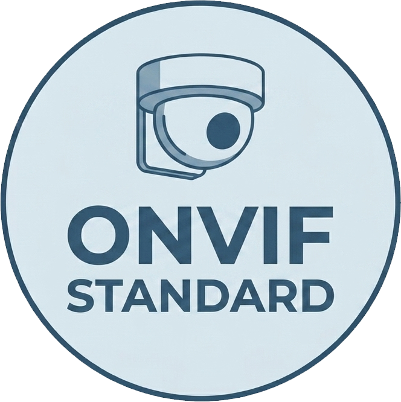

[](https://github.com/megedsh/OnvifStandard/blob/master/LICENSE.txt)
[](https://nuget.org/packages/OnvifStandard)



# 🌐 OnvifStandard — Modern ONVIF for .NET (No WCF)

A **.NET Standard 2.0** library for interacting with ONVIF‑compliant devices (IP cameras, NVRs, encoders) using **SOAP over HTTP** — **without WCF bindings**.  
Built for modern .NET, lightweight, and easy to extend.

---

## ✨ Features
- Pure **.NET Standard 2.0** implementation  
- **No WCF**, no generated bindings  
- Uses the excellent [`SoapHttpClient`](https://github.com/pmorelli92/SoapHttpClient)  
- Supports:
  - Device Service  
  - Media Service  
  - Imaging Service  
  - PTZ Service  

---

### 📘 Short Example — Get RTSP Stream + PTZ Control

```csharp
// 1. Get device information
var deviceClient = new DeviceClient
{
  //SoapClient = new SoapClient(new YourHttpClientFactory()),  <== Optional: Use a custom HttpClientFactory if needed
    ServiceUri = new Uri("http://camera-ip/onvif/device_service"),
    User = "username",
    Password = "password"
};
var deviceInfo = await deviceClient.GetDeviceInformation();

// 2. Create Media client
var mediaClient = new MediaClient
{
    ServiceUri = new Uri("http://camera-ip/onvif/media_service"),
    User = "username",
    Password = "password"
};

// 3. Get available media profiles
var profilesResponse = await mediaClient.GetProfiles();
var profile = profilesResponse.Profiles.First();

// 4. Get the RTSP stream URI
var streamSetup = new StreamSetup
{
    Stream = StreamType.RTPUnicast,
    Transport = new Transport { Protocol = TransportProtocol.RTSP }
};
var streamUriResponse = await mediaClient.GetStreamUri(streamSetup, profile.Token);
Console.WriteLine($"RTSP URI: {streamUriResponse.MediaUri.Uri}");

// 5. Use PTZ client to pan and zoom the camera
var ptzClient = new PtzClient
{
    ServiceUri = new Uri("http://camera-ip/onvif/ptz_service"),
    User = "username",
    Password = "password"
};
var velocity = new PTZSpeed
{
    PanTilt = new Vector2D { X = 0.5f, Y = 0 }, // pan right
    Zoom = new Vector1D { X = 0.2f }            // zoom in
};
await ptzClient.ContinuousMove(profile.Token, velocity);

```
---
## 💡 Why This Library Exists
I couldn’t find a modern, lightweight ONVIF library for .NET that didn’t rely on WCF.
Most ONVIF libraries rely on WCF bindings generated via `svcutil` or `dotnet-svcutil`.  
With modern tooling (including AI-assisted code generation), ONVIF services can be implemented **cleanly**, **manually**, and **without WCF**.  
This project aims to be a **modern, lightweight alternative** for developers who want ONVIF support without legacy baggage.

---

## 🛠️ Support & Compatibility
ONVIF devices vary widely — many implement only parts of the spec, and some behave… creatively.

If your device:
- fails on a specific call  
- returns unexpected SOAP responses  
- needs a custom quirk or extension  

👉 **Open an issue!**  
I’ll help add support, and contributions are very welcome.

Most of the code is AI‑generated, and only the features I needed are fully tested.  
If something doesn’t work, report it — or send a PR.

---

## ⚠️ Known Limitations
- **Not a video streaming library.**  
  ONVIF provides RTSP URLs; you’ll need another library to decode or display video.
- Some devices use **non‑standard ONVIF implementations**, which may require special handling.

---

## 🙏 Acknowledgements
- Inspired by the ONVIF standard and existing ONVIF libraries.  
- SOAP communication powered by [`SoapHttpClient`](https://github.com/pmorelli92/SoapHttpClient).  
  Go give that project a star — it deserves it.

---

## 🤝 Want to Contribute?
This project is intentionally simple and approachable — perfect for contributors.

Ways you can help:
- Add support for more ONVIF services  
- Improve device compatibility  
- Fix or refine AI‑generated DTOs  
- Add tests  
- Improve documentation  
- Share device logs or quirks  

A `CONTRIBUTING.md` will be added soon, but until then feel free to open issues or PRs.

---

## 🚀 Coming Soon (Community Roadmap)

- More ONVIF services (Events, Analytics, Recording)  
